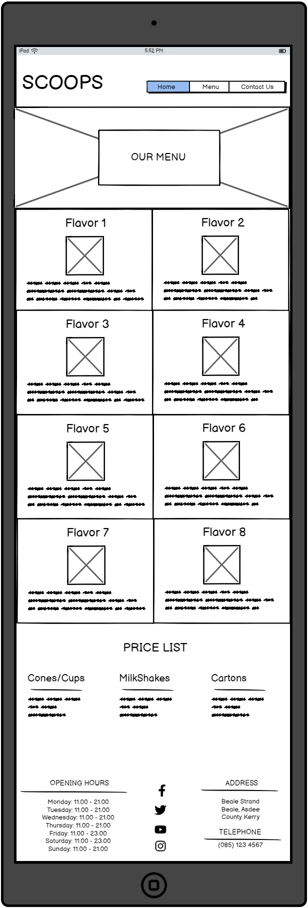
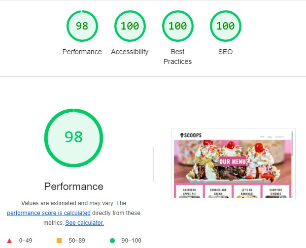

# Scoops Homemade Ice Cream Website

## Index - Table of Contents
* [Introduction](#introduction)
* [User Experience (UX)](#user-experience-ux) 
* [Target Audience](#target-audience) 
* [Site Goals](#site-goals) 
* [Design](#design)
* [Features](#features)
* [Technologies Used](#technologies-used)
* [Testing](#testing)
* [Deployment](#deployment)
* [Credits](#credits)

## Introduction
This website is for SCOOPS, a fictional artisan ice cream company located in Beale, County Kerry, Ireland. The company is focused on creating small batches of handmade quality product with fresh local ingredients. 

The website is targeted to users who want to purchase artisan ice cream made with quality ingredients. The site exhibits the various flavors offered as well as other important information to help users locate the business and purchase our product.  

## User Experience (UX)

### Target Audience
  - 

### Site Goals

  #### Site Owner Goals
  As the site/business owner I want to:
  - create an online presence to promote my business.
  - grow my customer base.
  - provide my customers with important information about my business, such as menu and opening hours.
  - provide my customers with a quick and easy means to contact us with any questions or concerns. 

  #### First Time Visitor Goals
  As a First Time User I want to:
  - easily navigate the website.
  - find out the location and opening hours.
  - easily understand the purpose of the site.
  - find the menu and prices.

  #### Returning Visitor Goals
  As a Returning User I want to:
  - easily find the menu and new offerings.
  - quickly access the opening hours.
  - provide feedback or ask questions.

## Design

### Colour
The colour scheme for this website is pink with white and black accents. The pink colour was extracted from the hero image using Microsoft Paint and various hues of that colour were used throughout the site. The colour scheme helps to provide a bright vibrant site that lifts the users mood as they navigate through it. 

### Fonts
Google Fonts was used to import the Lato and Oswald fonts. These were chosen as they compliment each other well and have a simple and modern aesthetic. 

### Wireframes

Home

Menu

Contact

## Features

### Logo and Navigation Bar
- A simple and interactive Logo and Navigation Bar is located at the top of each page. 
- The Logo links back to the homepage from any page throughout the site as this is a behaviour that would be expected by the user. 
- The navigation bar is located in the same position on each page and provides links to the three pages in the website (Home, Menu, Contact Us). 
- The page that the user is actively using is underlined in the navigation bar to provide a clear view as to which page they are currently on. 
- A thicker underline appears under each page name as the mouse hovers over it to assist in easy navigation for the user.
- The navigation bar is fully responsive on all screen sizes and collapses to a toggler on smaller screen sizes for ease of use. 

HTML Results - Home Page</a>
    - <a href="https://github.com/michelleduda/scoops-ice-cream/blob/main/documentation/validation-results/html-validation-menu.pdf" target="_blank">HTML Results - Menu Page</a>
    - <a href="https://github.com/michelleduda/scoops-ice-cream/blob/main/documentation/validation-results/html-validation-contact.pdf" target="_blank">HTML Results - Contact Us Page</a>
    - <a href="https://github.com/michelleduda/scoops-ice-cream/blob/main/documentation/validation-results/html-validation-confirmation.pdf" target="_blank">HTML Results - Confirmation Page</a>

- [CSS Validator](https://jigsaw.w3.org/css-validator)
  - Result for style.css
      

  - Full Validation Results available:
    - <a href="https://github.com/michelleduda/scoops-ice-cream/blob/main/documentation/validation-results/css-validation-results.pdf" target="_blank">CSS Results</a>

### Browser Compatibility

### Lighthouse Testing
- Lighthouse result for index.html
    
- Lighthouse result for menu.html
    
- Lighthouse result for contact.html
    
- Lighthouse result for confirmation.html
    

### Bugs
1. HTML Validator found stray end tag of for main element at line 155. Fixed.
### Known Bugs

## Deployment

### How This Site Was Deployed

This site was deployed via GitHub
1. Log into [GitHub](https://github.com).
2. Navigate to the repository [MichelleDuda/scoops-ice-cream](https://github.com/MichelleDuda/scoops-ice-cream).
3. Navigate to the [Settings Tab](https://github.com/MichelleDuda/scoops-ice-cream/settings).
4. Click on the [Pages](https://github.com/MichelleDuda/scoops-ice-cream/settings/pages) option in the left-hand pane. 
5. Select the main branch from the source dropdown menu.
6. Once the main branch has been selected the page will refresh automatically with a ribbon displaying that the deployment has been successful.
7. Any changes pused to the main branch will now take effect in the live project. 

Link to the live project: [SCOOPS Homemade Ice Cream](https://michelleduda.github.io/scoops-ice-cream/index.html)

## Credits

### Photos

1. [hero.webp](https://www.pexels.com/photo/sweet-ice-cream-with-fruit-16560507/) by David Disponett from Pexels. 
2. [applepie.webp](https://www.pexels.com/photo/delicious-ice-cream-on-plate-with-apple-pie-4340676/) by Spencer Davis from Pexels. 
3. [cookiesandcream.webp](https://www.pexels.com/photo/close-up-photo-of-cookies-and-cream-flavor-ice-cream-5060452/) by Roman Odintsov from Pexels.
4. [bananaicecream.webp](https://www.pexels.com/photo/ice-cream-with-chocolate-glaze-20683687/) by Ali Dashti from Pexels. 
5. [smores.webp](https://www.pexels.com/photo/chocolate-cake-with-vanilla-ice-cream-9500627/) by Gustavo Peres from Pexels. 
6. [strawberry.webp](https://www.pexels.com/photo/close-up-photo-of-strawberry-ice-cream-2161649/) by David Disponett from Pexels.
7. [caramelmacchiato.webp](https://www.pexels.com/photo/close-up-of-ice-cream-with-caramel-sauce-and-nuts-on-top-5060454/) by ROman Odintsov from Pexels. 
8. [birthdaycake.webp](https://www.pexels.com/photo/ice-cream-in-cone-16560569/) by David Disponett from Pexels. 
9. [sweetnsalty.webp](https://www.pexels.com/photo/tasty-desserts-served-on-table-in-cafe-6025811/) by Piotr Arnoldes from Pexels. 

### Code

1. Dynamic Resizing of iframe from [Stack Overflow](https://stackoverflow.com/questions/21868789/dynamically-resize-iframe).
2. Changing color of placeholder text from [W3Schools](https://www.w3schools.com/howto/howto_css_placeholder.asp).

### Acknowledgements

1. 