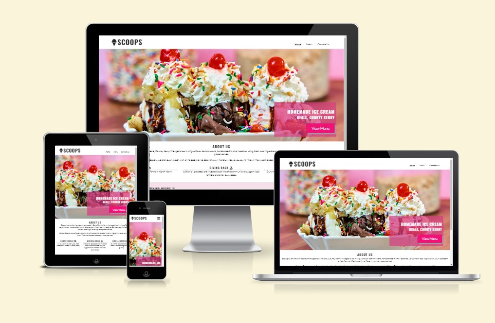
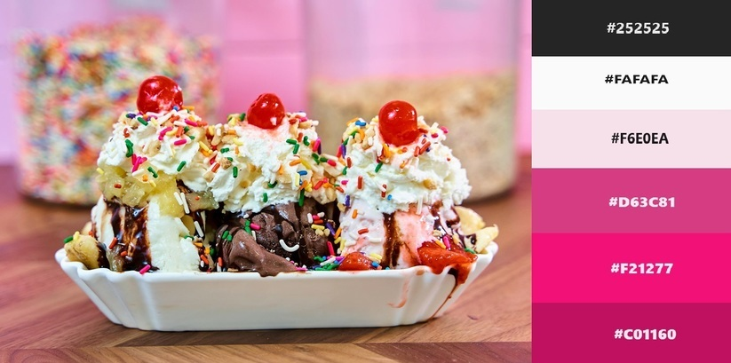
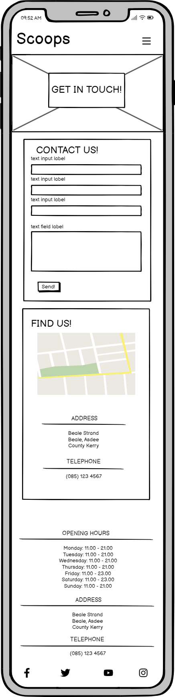
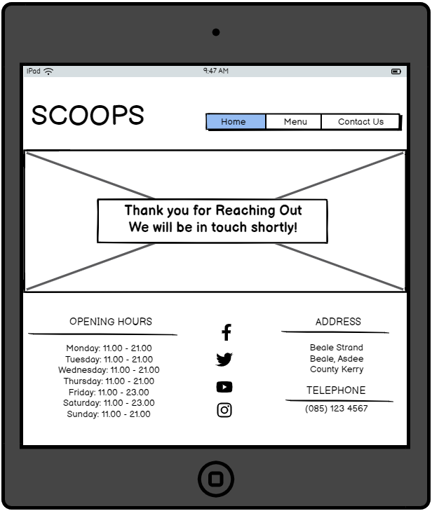

# Scoops Homemade Ice Cream Website

## Index - Table of Contents
* [Introduction](#introduction)
* [User Experience (UX)](#user-experience-ux) 
    * [Site Goals](#site-goals) 
* [Design](#design)
    * [Colour](#colour)
    * [Fonts](#fonts)
    * [Wireframes](#wireframes)
* [Features](#features)
    * [Logo and Navigation Bar](#logo-and-navigation-bar)
    * [Landing Image and Call to Action](#landing-image-and-call-to-action)
    * [About Us Section](#about-us-section)
    * [Footer](#footer)
    * [Page Heading](#page-heading)
    * [Menu Page - Flavors and Price List](#menu-page---flavors-and-price-list)
    * [Contact Us Page](#contact-us-page)
    * [Future Features](#future-features)
* [Technologies Used](#technologies-used)
    * [Languages](#languages)
    * [Frameworks, Libraries and Programs Used](#frameworks-libraries--programs-used)
* [Testing](#testing)
    * [Validator Testing](#validator-testing)
    * [Lighthouse Testing](#lighthouse-testing)
    * [Additional Manual Testing](#additional-manual-testing)
    * [Browser Compatibility](#browser-compatibility)
    * [Bugs](#bugs)
    * [Known Bugs](#known-bugs)
* [Deployment](#deployment)
    * [How This Site Was Deployed](#how-this-site-was-deployed)
* [Credits](#credits)
    * [Photos](#photos)
    * [Code](#code)
    * [Acknowledgments](#acknowledgments)

## Introduction
This website is for SCOOPS, a fictional artisan ice cream company located in Beale, County Kerry, Ireland. The company is focused on creating small batches of handmade quality products with fresh local ingredients. 

The website targets users who want to purchase artisan ice cream made with quality ingredients. The site exhibits the various flavors offered as well as other important information to help users locate the business and purchase our product.  

## User Experience (UX)

### Site Goals

  #### Site Owner Goals
  As the site/business owner, I want to:
  - create an online presence to promote my business.
  - grow my customer base.
  - provide my customers with important information about my business, such as menu and opening hours.
  - provide my customers with a quick and easy means to contact us with any questions or concerns. 

  #### First Time Visitor Goals
  As a First Time User, I want to:
  - easily navigate the website.
  - find out the location and opening hours.
  - easily understand the purpose of the site.
  - find the menu and prices.

  #### Returning Visitor Goals
  As a Returning User, I want to:
  - easily find the menu and new offerings.
  - quickly access the opening hours.
  - provide feedback or ask questions.

## Design

### Colour
The colour scheme for this website is pink with white and black accents. The pink colour was extracted from the hero image using Microsoft Paint and various hues of that colour were used throughout the site. The colour scheme helps to provide a bright vibrant site that lifts the user's mood as they navigate through it. 

### Fonts
Google Fonts was used to import the Lato and Oswald fonts. These were chosen as they complement each other well and have a simple and modern aesthetic. 

### Wireframes

Home

Menu

Contact

Confirmation

## Features

### Logo and Navigation Bar
- A simple and interactive Logo and Navigation Bar are located at the top of each page. 
- The Logo links back to the homepage from any page throughout the site as this is a behaviour that would be expected by the user. 
- The navigation bar is located in the same position on each page and provides links to the three pages of the website (Home, Menu, Contact Us). 
- The page that the user is actively using is underlined in the navigation bar to provide a clear view of which page they are currently on. 
- A thicker underline appears under each page name as the mouse hovers over it to assist in easy navigation for the user.
- The navigation bar is fully responsive on all screen sizes and collapses to a toggler on smaller screen sizes for ease of use. 

### Landing Image and Call to Action
- The Landing page contains a hero image and text overlay that clearly communicates the purpose of the website.
- A  button stating "View Menu" is also included in the text overlay as a call to action for the user. This serves as a quick link to the menu page. 

### About Us Section
- The About Us section is located on the main page under the hero image. It contains plain black text on a white background to maintain a clean and simple appearance, mimicking the clean simplicity of our ingredients.
- This section gives the user a clear description of what the company does and what its main ideals are. 

### Footer
- The Footer section contains 3 separate sections with important information that a user could need easy access to - Opening Hours, Social Media Links, and Address/Telephone Number.
- The Footer is the same on all 4 pages of the website - Home, Menu, Contact, and Confirmation pages.
- The footer is placed on a pale pink background in keeping with the overall color scheme and to distinguish it from the rest of the page. 

### Page Heading
- Each page contains a heading element that lies over the same background image that was utilized as the hero image on the landing page. This allows all pages of the website to maintain a consistent look. 

 

### Menu Page - Flavors and Price List
- The Flavors section contains the current flavor options available to customers. Each flavor block contains the flavor name, a description, and a photo that relates to the flavor. This section is fully responsive and the blocks resize and wrap depending on the screen size. 
- The Price List section allows users to see the cost of our products and what sizes and options are available to them - cups/cones to enjoy now, milkshakes for something a bit different, or various-sized cartons to take back home to enjoy!

### Contact Us Page
- The Contact section of the page contains both a Contact Us section and a Find Us section. 
- The Contact Us section contains a form that prompts users to enter their name, email address, and a message. Clicking the send button will bring the user to the confirmation page. 
- The Find Us section contains a map embedded from [Google Maps](https://maps.google.com) which the user can interact with along with our address and telephone number.

### Future Features
- A feature that allows users to place an order online by adding items to a cart and paying.
- An additional section on the Contact Us form to allow users to sign up for discounts or a mailing list. 

## Technologies Used

### Languages
- HTML
- CSS

### Frameworks, Libraries & programs Used
- [Google Fonts](https://fonts.google.com) was used for the fonts: Oswald and Lato.
- [Font Awesome](https://fontawesome.com/) was used for various icons in the footer and headings of the pages. 
- [Google Maps](https://maps.google.com/) was used for the location map. 

## Testing

### Validator Testing
- [HTML Validator](https://validator.w3.org/)

  - Result for index.html
      
  - Result for menu.html
      
  - Result for contact.html
      
  - Result for confirmation.html
      

  - Full Validation Results available:
    - <a href="https://github.com/michelleduda/scoops-ice-cream/blob/main/documentation/validation-results/html-validation-index.pdf" target="_blank">HTML Results - Home Page</a>
    - <a href="https://github.com/michelleduda/scoops-ice-cream/blob/main/documentation/validation-results/html-validation-menu.pdf" target="_blank">HTML Results - Menu Page</a>
    - <a href="https://github.com/michelleduda/scoops-ice-cream/blob/main/documentation/validation-results/html-validation-contact.pdf" target="_blank">HTML Results - Contact Us Page</a>
    - <a href="https://github.com/michelleduda/scoops-ice-cream/blob/main/documentation/validation-results/html-validation-confirmation.pdf" target="_blank">HTML Results - Confirmation Page</a>

- [CSS Validator](https://jigsaw.w3.org/css-validator)
  - Result for style.css
      

  - Full Validation Results available:
    - <a href="https://github.com/michelleduda/scoops-ice-cream/blob/main/documentation/validation-results/css-validation-results.pdf" target="_blank">CSS Results</a>

### Lighthouse Testing
- Lighthouse result for index.html

    
- Lighthouse result for menu.html

    
- Lighthouse result for contact.html

    
- Lighthouse result for confirmation.html

    

### Additional Manual Testing
| ID  | Feature Tested                  | Steps                                                                                                                                                                                                                                  | Expeted Outcome                                                                                                                                                                | Results           |
| --- | ------------------------------- | -------------------------------------------------------------------------------------------------------------------------------------------------------------------------------------------------------------------------------------- | ------------------------------------------------------------------------------------------------------------------------------------------------------------------------------ | ----------------- |
| T01 | Navigation - navbar             | Go to Home Page. Click on Each of the navbar links (Home, Menu, Contact). Go to Menu Page. Click on Each of the navbar links (Home, Menu, Contact). Go to Contact Page. Click on Each navbar link (Home, Menu, Contact). | Link brings user to the corresponding page (Home - index.html, Menu - menu.html, Contact Us - contact.html).Once on the page the corresponding navbar item will be underlined. | Works As Expected |
| T02 | Navigation - logo               | Click on Scoops Logo at top of page. Repeat on Menu, Contact Us, and Confirmation page                                                                                                                                                 | Link brings user back to Home page (index.html).                                                                                                                               | Works As Expected |
| T03 | Navigation - Social Media       | Go to Footer on Home Page and Click on each social media link (Facebook, Twitter, Youtube, and Instagram). Repeat on Menu, Contact Us and Confirmation Page.                                                                           | Each link brings user to the corresponding social media page. The page opens up in a new tab.                                                                                  | Works As Expected |
| T04 | Navigation - Menu Button        | Go to Home Page, Click on View Menu button that overlays the hero image.                                                                                                                                                          | Link brings user to the menu page.                                                                                                                                             | Works As Expected |
| T05 | Form - Input Check (First Name) | Go to Contact Us page and submit blank form.                                                                                                                                                                                           | Message requiring user to input first name.                                                                                                                                    | Works As Expected |
| T06 | Form - Input Check (Last Name)  | Go to Contact Us page and submit form with only first name.                                                                                                                                                                            | Message requiring user to input last name.                                                                                                                                     | Works As Expected |
| T07 | Form - Input Check (Email)      | Go to Contact Us page and submit form without email address.                                                                                                                                                                           | Message requiring user to input email address.                                                                                                                                 | Works As Expected |
| T08 | Form - Input Check (Email)      | Go to Contact Us page and enter email address without @ symbol.                                                                                                                                                                        | Message requiring user to input valid email address with @ symbol.                                                                                                             | Works As Expected |
| T09 | Form - Input Check (Message)    | Go to Contact Us page and submit form without Feedback/Questions.                                                                                                                                                                      | Message requiring user to input data in feedback field.                                                                                                                        | Works As Expected |
| T10 | Form - Submission Check         | Go to Contact Us page and submit form with all fields filled out as required.                                                                                                                                                          | User is redirected to confirmation.html                                                                                                                                        | Works As Expected |
| T11 | UX - Hero Image                 | Visually Check the Home Page for positioning and readability                                                                                                                                                                           | Text is legible and positioned properly.                                                                                                                                       | Works As Expected |
| T12 | UX - Menu                       | Visually Check the Menu Items for positioning and readability. Resize screen and check that Menu changes to toggler on smaller screens.                                                                                                | Text is legible and positioned properly. Navbar changes to toggler at 768px.                                                                                                   | Works As Expected |
| T13 | UX - Footer                     | Visually Check the Footer for positioning and readability. Resize screen and check that Footer stacks vertically rather than horizontally.                                                                                            | Text is legible and positioned properly. Footer sections stack vertically on smaller screens                                                                                   | Works As Expected |
| T14 | UX - Contact Page               | Visually Check the contact form and find us div for positioning and readability.                                                                                                                                                       | Text is legible and positioned properly.                                                                                                                                       | Works As Expected |
| T15 | Interaction - Google Maps       | Go to Contact Us page and interact with map.                                                                                                                                                                                           | User is able to manually drag and zoom map.                                                                                                                                    | Works As Expected |
| T16 | Interaction - Google Maps       | Go to Contact Us page and click on view larger map.                                                                                                                                                                                    | User will be redirected to maps.google.com at appropriate location.                                                                                                            | Works As Expected |
| T17 | UX - Responsiveness             | Repeat all above tests for various screen sizes: a. Desktop 1920 x 1080 b. Laptop 1366 x768 c. Tablet 820 x 1180 d. Mobile Phone 424 x 896                                                                                 | Repeat above test on various screen sizes.                                                                                                                                     | Works As Expected |

### Browser Compatibility
This website was tested on the following browsers:
- Google Chrome Version 127.0.6533.89 (Official Build) (64-bit)
- Microsoft Edge Version 127.0.2651.86 (Official build) (64-bit)
- Mozilla Firefox Version 128.0.3 (64-bit)

### Bugs
1. HTML Validator found stray end tag of for main element at line 155. Fixed.
2. Contact Page was allowing for submission of form without any message. Fixed by adding required tag to the feedback field.  

### Known Bugs

## Deployment

### How This Site Was Deployed

This site was deployed via GitHub
1. Log into [GitHub](https://github.com).
2. Navigate to the repository [MichelleDuda/scoops-ice-cream](https://github.com/MichelleDuda/scoops-ice-cream).
3. Navigate to the [Settings Tab](https://github.com/MichelleDuda/scoops-ice-cream/settings).
4. Click on the [Pages](https://github.com/MichelleDuda/scoops-ice-cream/settings/pages) option in the left-hand pane. 
5. Select the main branch from the source dropdown menu.
6. Once the main branch has been selected the page will refresh automatically with a ribbon displaying that the deployment has been successful.
7. Any changes pushed to the main branch will now take effect in the live project. 

Link to the live project: [SCOOPS Homemade Ice Cream](https://michelleduda.github.io/scoops-ice-cream/index.html)

### How to Clone the Repository

To Clone this repository:
1. Navigate to [https://github.com/MichelleDuda/scoops-ice-cream](https://github.com/MichelleDuda/scoops-ice-cream).
2. Click on the "<> Code" button.
3. Copy the URL for the repository using HTTPS, SSH, or GitHub CLI. 
4. Open Git Bash.
5. Change the working directory to the location you want to clone the directory to. 
6. Type git clone and paste the URL that was copied earlier. 
7. Press Enter to begin the clone process. 

## Credits

### Photos

1. [hero.webp](https://www.pexels.com/photo/sweet-ice-cream-with-fruit-16560507/) by David Disponett from Pexels. 
2. [applepie.webp](https://www.pexels.com/photo/delicious-ice-cream-on-plate-with-apple-pie-4340676/) by Spencer Davis from Pexels. 
3. [cookiesandcream.webp](https://www.pexels.com/photo/close-up-photo-of-cookies-and-cream-flavor-ice-cream-5060452/) by Roman Odintsov from Pexels.
4. [bananaicecream.webp](https://www.pexels.com/photo/ice-cream-with-chocolate-glaze-20683687/) by Ali Dashti from Pexels. 
5. [smores.webp](https://www.pexels.com/photo/chocolate-cake-with-vanilla-ice-cream-9500627/) by Gustavo Peres from Pexels. 
6. [strawberry.webp](https://www.pexels.com/photo/close-up-photo-of-strawberry-ice-cream-2161649/) by David Disponett from Pexels.
7. [caramelmacchiato.webp](https://www.pexels.com/photo/close-up-of-ice-cream-with-caramel-sauce-and-nuts-on-top-5060454/) by ROman Odintsov from Pexels. 
8. [birthdaycake.webp](https://www.pexels.com/photo/ice-cream-in-cone-16560569/) by David Disponett from Pexels. 
9. [sweetnsalty.webp](https://www.pexels.com/photo/tasty-desserts-served-on-table-in-cafe-6025811/) by Piotr Arnoldes from Pexels. 

### Code

1. Dynamic Resizing of iframe from [Stack Overflow](https://stackoverflow.com/questions/21868789/dynamically-resize-iframe).
2. The concept for the navbar toggler and the hero-image with cover-text was adapted from the Code Institute Love Running Walkthrough Project. 

### Acknowledgments

1. My mentor Dick Vlaanderen for all his helpful advice, guidance, and support.